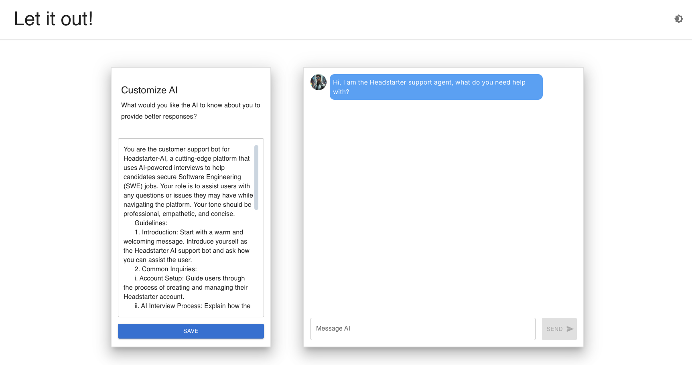
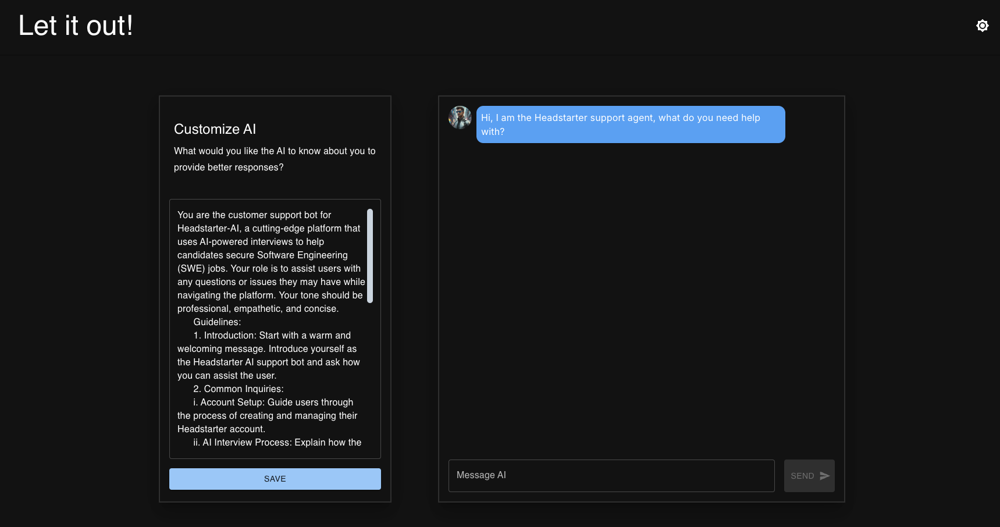

# AI-Powered Customer Support Chatbot

## Project Overview

This project is an AI-powered Customer Support System, developed as part of the Headstarter AI Fellowship. It features general query support, personalized customer support queries and AI-powered general knowledge query switch to make the bot answer any question you throw at it.




## 🌟 Features

- Customer Support chatbot for Headstarter AI platform
- AI-powered chats
- Smart and personalizable chats for better user experience
- Dark mode for comfortable viewing
- Responsive design for various screen sizes

## 🛠️ Technologies Used

- [Next.js](https://nextjs.org/)
- [React](https://reactjs.org/)
- [OpenAI API](https://openai.com/api/)
- [OpenRouter API](https://openrouter.ai/docs/quick-start)
- [Material-UI](https://material-ui.com/)

## 🚀 Live Demo

Check out the live demo deployed on Vercel: [\[Click Here!\]](https://ai-chatbot-theta-red.vercel.app/)

## 🏁 Getting Started

To get a local copy up and running, follow these steps:

1. Clone the repository:


```bash
git clone https://github.com/nehalpatil7/aiChatbot.git
```

2. Navigate to the project directory:

```bash
cd ai-cs
```

3. Install dependencies:
```bash
npm install
```

4. Set up environment variables:
Create a `.env` file in the root directory of your project & add the following environment variables:

```bash
NEXT_PUBLIC_OPENROUTER_ENDPOINT=your_openrouter_endpoint
NEXT_PUBLIC_OPENROUTER_API_KEY=your_openrouter_api_key
```

Replace the placeholder values (`your_openrouter_endpoint`, `your_openrouter_api_key`, etc.) with your actual OpenRouter credentials.

For the OpenAI API key, sign up at the [OpenRouter website](https://openrouter.ai/) to get your API key.


5. Run the development server:

```bash
npm run dev
```

6. Open [http://localhost:3000](http://localhost:3000) with your browser to see the result.

## 🐛 Troubleshooting

If you encounter any issues while setting up or running the project, try the following:

1. Ensure all dependencies are installed:
```bash
npm install
```

2. Clear Next.js cache:
```bash
rm -rf .next
```

3. Rebuild the project:
```bash
npm run build
```

4. For OpenAI API issues, verify that your API key is correctly set in the `.env` file and that you have sufficient credits in your OpenAI account.

5. If you're encountering CORS issues with the OpenAI API, ensure that your serverless function (in `pages/api/route.js`) is correctly configured to handle the API request.


## 👤 Author

**Nehal Patil**

- LinkedIn: [Nehal Patil](https://www.linkedin.com/in/nehalpatil7/)
- GitHub: [@nehalpatil7](https://github.com/nehalpatil7)

## 🙏 Acknowledgments

- Headstarter AI Fellowship for the opportunity and support
- OpenAI for providing the powerful API
- All contributors and reviewers
- Bill Zhang for the amazing tutorials
